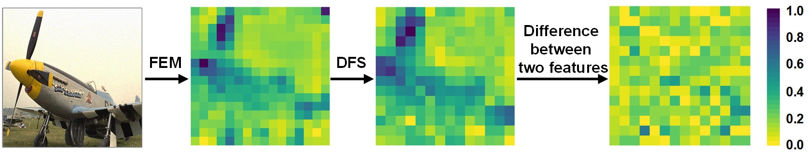

# DFST
a blind image quality assessment method
Code for DFST


## Feature visualizations: the difference between heatmaps before/after screening is illustrated.



## Dataset
| Dataset   | Links                                                       |
| --------- | ----------------------------------------------------------- |
| TID2013      | http://www.ponomarenko.info/tid2013.htm     |
| KADID10K      | http://database.mmsp-kn.de/kadid-10k-database.html      |
| LIVE-C      | https://live.ece.utexas.edu/research/ChallengeDB/index.html      |
| LIVE      | https://live.ece.utexas.edu/research/Quality/subjective.htm          |
| CSIQ      | https://s2.smu.edu/~eclarson/csiq.html |
| SPAQ      | https://github.com/h4nwei/SPAQ |
| KonIQ      | http://database.mmsp-kn.de/koniq-10k-database.html |
| AGIQA     |  https://github.com/lcysyzxdxc/AGIQA-3k-Database |

## Ablation study on SPAQ and CSIQ 

### Effectiveness of the network
|    |       |        |    | SPAQ     |    SPAQ |    CSIQ |  CSIQ  |
| :---: |    :---:     |    :---:    |  :---: | :---:     |    :----: |    :---: |  :-----:  |
|   #   |        Salient   |   Non-salient        |   SAM  |    PLCC  |    SRCC |  PLCC   |  SRCC  |
|   1   |                  |                      |   √    |   0.795  |   0.784 |  0.822  | 0.831  |
|   2   |   √              |                      |   √    |   0.857  |   0.847 |  0.874  | 0.867  |
|   3   |                  |     √                |   √    |   0.816  |   0.828 |  0.843  | 0.833  |
|   4   |   √              |     √                |        |   0.879  |   0.853 | 0.892   | 0.876  |
|   5   |   √              |     √                |   √    |   0.929  |   0.921 | 0.966   | 0.963  |

### Effectiveness of DFS
|    |       |        |    | SPAQ     |    SPAQ |    CSIQ |  CSIQ  |
|  :---: |    :---:     |    :---:    | :---: | :---:     |    :----: |    :---: |  :-----:  |
|   #   |     RRB          |   RSC                |   RC   |    PLCC  |    SRCC |  PLCC   |  SRCC  |
|   1   |                  |                      |        |   0.831  |   0.830 |  0.852  | 0.857  |
|   2   |   √              |                      |        |   0.877  |   0.864 |  0.901  | 0.884  |
|   3   |                  |     √                |        |   0.904  |   0.899 |  0.917  | 0.0.4  |
|   4   |   √              |     √                |        |   0.910  |   0.906 | 0.925   | 0.930  |
|   5   |   √              |     √                |   √    |   0.929  |   0.921 | 0.966   | 0.963  |


## Comparison between other SOTA methods in SRCC on cross-datasets

### Cross-dataset testing contains various distortions
|   Meta-learning  |   TID2013   KADID    |  KADID  |  TID2013 | 
|    :---:    |    :---:     |    :---:    |  :---:    |
|   Fine-tuning  |   LIVEC    |  LIVEC  |  LIVEC |
|   HyperIQA     |   0.856    |  0.861  |  0.852 |
|   MUSIQ        |   0.884    |  0.834  |  0.871 |
|   DEIQT        |   0.874    |  0.882  |  0.862 |
|   CICI         |   0.844    |  0.846  |  0.857 |
|   Ours         |   0.911    |  0.894  |  0.873 |
|   Fine-tuning  |   CSIQ     |  CSIQ   |  CSIQ  |
|   HyperIQA     |   0.876    |  0.859  |  0.860 |
|   MUSIQ        |   0.867    |  0.870  |  0.886 |
|   DEIQT        |   0.914    |  0.920  |  0.876 |
|   CICI         |   0.910    |  0.927  |  0.901 |
|   Ours         |   0.950    |  0.956  |  0.931 |

### Cross-dataset testing contains various content types
|   Meta-learning  |   TID2013   KADID    |  KADID  |  TID2013 | 
|    :---:    |    :---:     |    :---:    |  :---:    |
|   Fine-tuning  |   AGIQA-3k | AGIQA-3k|AGIQA-3k|
|   HyperIQA     |   0.828    |  0.822  |  0.819 |
|   MUSIQ        |   0.812    |  0.785  |  0.792 |
|   DEIQT        |   0.842    |  0.807  |  0.821 |
|   CICI         |   0.831    |  0.809  |  0.804 |
|   Ours         |   0.872    |  0.856  |  0.846 |
|   Fine-tuning  |  AGIQA-20k |AGIQA-20k|AGIQA-20k|
|   HyperIQA     |   0.755    |  0.804  |  0.739  |
|   MUSIQ        |   0.794    |  0.752  |  0.766  |
|   DEIQT        |   0.802    |  0.794  |  0.763  |
|   CICI         |   0.760    |  0.728  |  0.700  |
|   Ours         |   0.825    |  0.813  |  0.822  |

## Screening rate on LIVE-C, LIVE, CSIQ, and SPAQ. We calculated the rate of images with different 0.2 error, while using DFS.
|   Error  |   LIVE-C |  LIVE  |  CSIQ |  SPAQ  | 
|   :---:  |   :---:  |  :---: | :---: |  :---: |
|   0.0< <0.1   |   9.8%    |  2.1% | 1.7%  |  5.2%  |
|   0.1< <0.2   |   73.9%   |  84.1% | 87.3%  |  78.8%  |
|   0.2< <0.3   |   6.2%    |  10.5% | 5.4%  |  2.3%  |
|   0.3< <0.5   |   7.8%    |  2.1% | 4.2%  |  8.6%  |
|   0.5< <1.0   |   2.3%    |  1.2% | 1.4%  |  5.1%  |


## Requirements
- PyTorch=1.7.0
- Torchvision=0.8.1
- numpy=1.21.6
- scipy=1.7.3
- h5py=3.7.0
- opencv-python =4.7.0.72
- need to updown the weights of ViT, and name is with "pytorch_model.bin".
## Usages

### Screen out salient regions and non-salient regions of images

If you want to get salient regions and non-salient regions, you need to run screen_salient_data.py.

```
screen_salient_data.py
```

You will get new datasets, and these datasets are inputs of the model.


####  Q1  When deal with single typle task (open the file "single_task")
```
run.py
```
Then a quality model will be trained.

####  Q21  When deal with multi-typle task (open the file "meta_multi_tasks")
### Meta training on IQA databases
First you need to modify config paramters to make sure the database path is correct.
Meta training  our model on IQA Dataset.
```
MetaIQA_newload.py
```
Then a quality model will be trained.(TID2013_KADID10K_4_1.pt)

Some available options:
* `--dataset`: Meta training  dataset, support datasets: TID2013 |KADID10K| LIVE | CSIQ | .
* `--lr`: Learning rate.
* `--save_path`: Model and paramter save path.
* `--batch_size`: Batch size.
* `--epochs`:Epochs
* 
```
If you want to repartition the dataset, you'll need to make a new mat file instead.

### Fine-tuning for different datasets(Here is an example for CSIQ.)
```
Finetune_csiq_4_1.py
```
Some available options:
* `--dataset_dir`:  Fine-tuning dataset image path.
* `--model_file`: Model and paramter path.
* `--dataset`:  Testing dataset, support datasets:  LIVE-C | SPAQ | KonIQ | CSIQ| AGIQA |.
* `--predict_save_path`: The plcc and srcc are recorded in TID2013_KADID_LIVEC.txt or ew_load_scores.csv.
